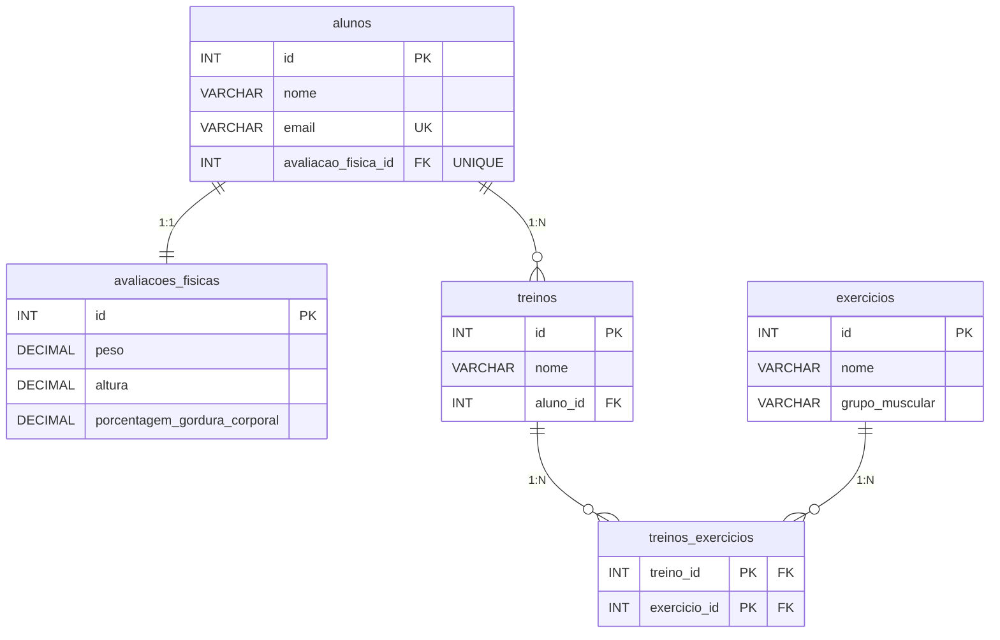

# 🏋️ Gym API — Spring Boot

REST API para gerenciamento de alunos, treinos, exercícios e avaliações físicas de uma academia.

Construída com **Spring Boot 3**, **Spring Data JPA**, **MySQL** e **Docker**.

---

## Tecnologias

- **Java 21**
- **Spring Boot 3**
- **Spring Data JPA + Hibernate**
- **Spring Validation**
- **MySQL 8**
- **Docker + Docker Compose**
- **Lombok**
- **Maven**

---

## Diagrama do Banco de Dados



---

## Endpoints

### Alunos — `/v1/alunos`

| Método | Rota | Descrição |
|---|---|---|
| `POST` | `/v1/alunos` | Cadastra um novo aluno |
| `GET` | `/v1/alunos` | Lista todos os alunos |

### Avaliações Físicas — `/v1/avaliacoes`

| Método | Rota | Descrição |
|---|---|---|
| `POST` | `/v1/avaliacoes` | Cadastra avaliação física de um aluno |

### Exercícios — `/v1/exercicios`

| Método | Rota | Descrição |
|---|---|---|
| `POST` | `/v1/exercicios` | Cadastra um novo exercício |
| `GET` | `/v1/exercicios` | Lista todos os exercícios |
| `GET` | `/v1/exercicios/grupos/{grupoMuscular}` | Filtra exercícios por grupo muscular |

---

## Exemplos de Request

### Criar aluno
```http
POST /v1/alunos
Content-Type: application/json

{
  "nome": "Diogo Pelinson",
  "email": "diogo@email.com"
}
```

### Criar avaliação física
```http
POST /v1/avaliacoes
Content-Type: application/json

{
  "alunoId": 1,
  "peso": 80.5,
  "altura": 1.78,
  "porcentagemGorduraCorporal": 15.2
}
```

### Criar exercício
```http
POST /v1/exercicios
Content-Type: application/json

{
  "nome": "Supino Reto",
  "grupoMuscular": "Peito"
}
```

---

## Estrutura do Projeto

```
src/main/java/br/com/devpelinson/spring_boot_essentials/
├── config/
├── controller/
│   ├── AlunosController
│   ├── AvaliacoesFisicasController
│   └── ExerciciosController
├── database/
│   ├── model/
│   │   ├── AlunosEntity
│   │   ├── AvaliacoesFisicasEntity
│   │   ├── ExerciciosEntity
│   │   └── TreinosEntity
│   └── repository/
│       ├── IAlunosRepository
│       ├── IAvaliacoesFisicasRepository
│       ├── IExerciciosRepository
│       └── ITreinosRepository
├── dto/
│   ├── AlunoDTO
│   ├── AvaliacaoFisicaDto
│   └── ExercicioDto
├── exception/
│   ├── BadRequestException
│   ├── NotFoundException
│   └── ErrorResponse
├── handler/
│   └── GlobalExceptionHandler
├── service/
│   ├── AlunosService
│   ├── AvaliacaoFisicaService
│   └── ExerciciosService
└── utils/
```

---

## Como rodar

### Pré-requisitos

- Docker e Docker Compose instalados
- Java 21
- Maven

### 1. Suba o banco com Docker

```bash
docker run --name gym-mysql \
  -e MYSQL_ROOT_PASSWORD=root \
  -e MYSQL_DATABASE=gym \
  -p 3306:3306 \
  -d mysql:8
```

### 2. Configure as variáveis de ambiente

```bash
export DB_USERNAME=root
export DB_PASSWORD=root
```

### 3. Rode a aplicação

```bash
./mvnw spring-boot:run
```

A API estará disponível em `http://localhost:8082`.

---

## Configuração — `application.yml`

```yaml
server:
  port: 8082

spring:
  datasource:
    url: jdbc:mysql://localhost:3306/gym?createDatabaseIfNotExist=true
    username: ${DB_USERNAME}
    password: ${DB_PASSWORD}
  jpa:
    hibernate:
      ddl-auto: create-drop
    show-sql: true
```

---

## Relacionamentos JPA

| Entidade | Relacionamento | Entidade |
|---|---|---|
| Aluno | `@OneToOne` | AvaliacaoFisica |
| Aluno | `@OneToMany` | Treinos |
| Treino | `@ManyToOne` | Aluno |
| Treino | `@ManyToMany` | Exercicios |

O relacionamento `@OneToOne` entre `Aluno` e `AvaliacaoFisica` usa `CascadeType.ALL` — ao salvar o aluno, a avaliação física é persistida automaticamente.

---

## Autor

**Diogo Pelinson Moraes**
[LinkedIn](https://linkedin.com/in/diogopelinsonmoraes) · [GitHub](https://github.com/diogopelinson)
